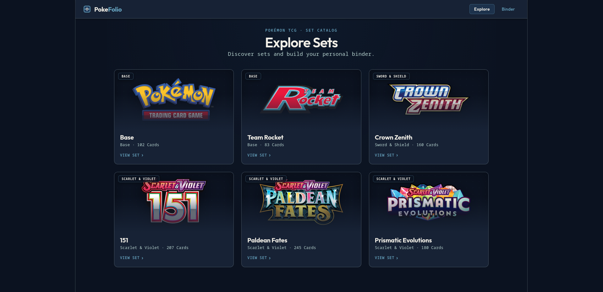
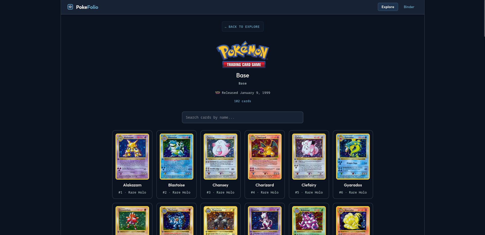
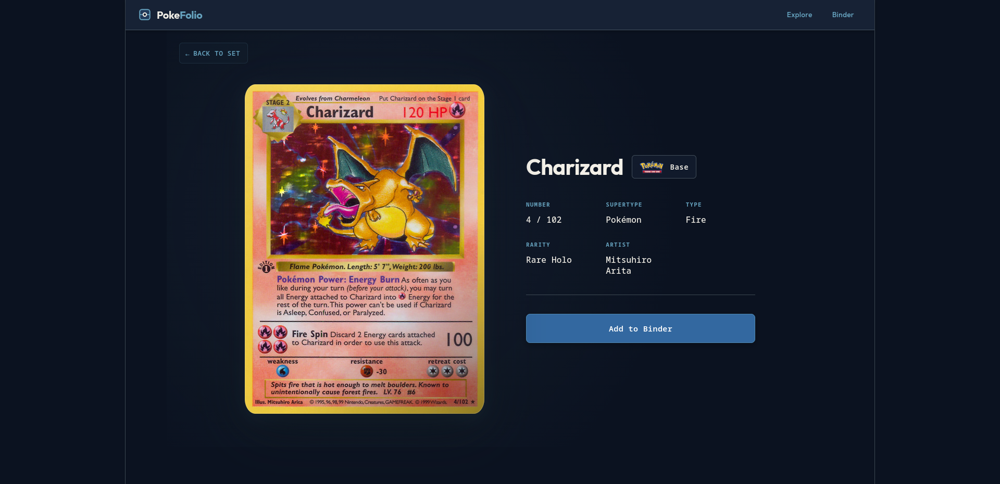
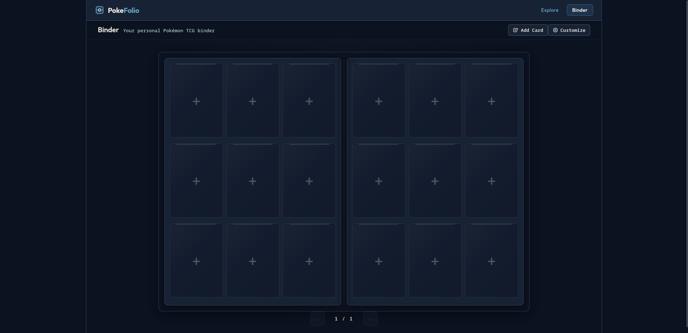
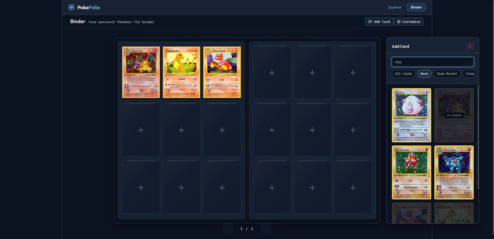
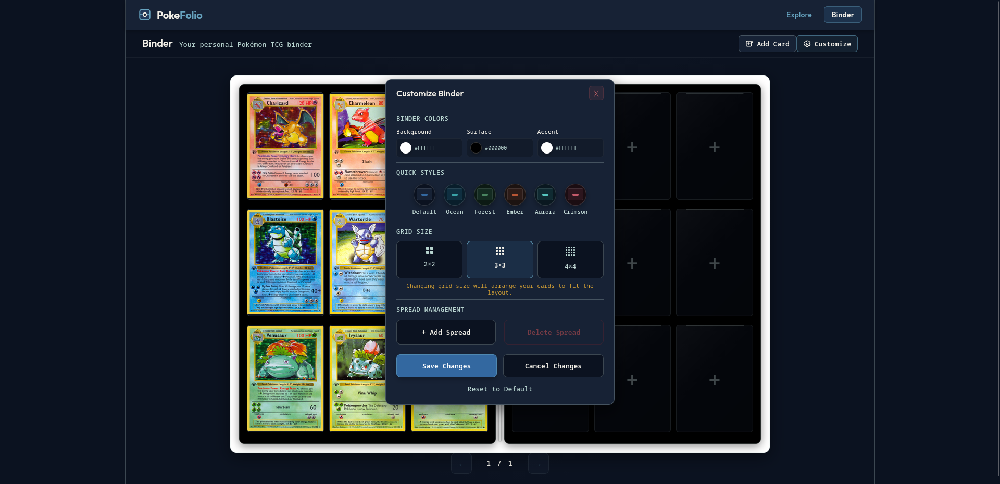
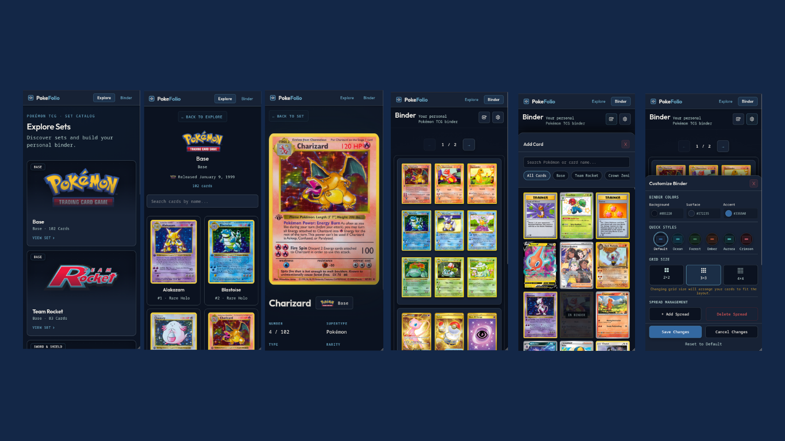

# PokeFolio

> Student Project — APSI Final Project

## 1. Overview

PokeFolio is a digital Pokémon TCG binder that recreates the experience of a physical card binder as a web app. It's for collectors who want to explore, organize, and showcase Pokémon cards visually — without the market pricing, trading, deck building, or account system that most TCG tools bolt on. Users browse curated card sets, add cards to a personal binder, arrange them across pages and spreads, and customize the binder's look, all without creating an account.

## 2. Setup and installation

### Prerequisites

- Node.js
- PostgreSQL
- A [Pokémon TCG API Developer Portal](https://dev.pokemontcg.io/) API key
- Git

### Clone the repository

```powershell
git clone https://github.com/lanixiligan/pokefolio.git
cd pokefolio
```

### Install dependencies

```powershell
# Frontend
cd client
npm install

# Backend
cd ..\server
npm install
```

### Environment and configuration

Backend configuration lives in `server/.env`, based on the template at `server/.env.example`:

```powershell
Copy-Item .env.example .env
```

Then fill in `server/.env` with your own values:

| Variable | Example | Notes |
| --- | --- | --- |
| `PGHOST` | `localhost` | PostgreSQL host |
| `PGPORT` | `5432` | PostgreSQL port |
| `PGDATABASE` | `pokefolio` | Database name |
| `PGUSER` | `postgres` | Database user |
| `PGPASSWORD` | `your-local-postgres-password` | Database password |
| `POKEMON_TCG_API_KEY` | `your-pokemon-tcg-api-key` | Backend-only; never exposed to the frontend |

**Never commit `server/.env` or expose the Pokémon TCG API key to the frontend.** See [Security](#security) below.

### Set up and seed the database

From `server\`:

```powershell
npm run migrate   # apply schema migrations
npm run seed      # import the card catalog (run only when you need to populate/refresh it)
npm run db:check  # sanity-check the database
```

## 3. How to run it

Start the backend (from `server\`):

```powershell
npm run dev
```

The API runs at `http://localhost:5000`.

Start the frontend, in a second terminal (from `client\`):

```powershell
npm run dev
```

Open the URL Vite prints, normally `http://localhost:5173`. You should land on the **Explore** page listing the six supported sets — that's confirmation the frontend is talking to the backend and the database is seeded.

## 4. Features and usage

**Primary flow:** Explore → choose a set → browse/search cards → view card details → add to binder → organize the binder → customize the binder.

- Explore six curated English Pokémon TCG sets (see table below)
- Browse and search cards by name within a set
- View detailed card information
- Add cards to a personal digital binder — no account required, identity is a browser-scoped anonymous ID
- Organize the binder: move cards between positions, swap cards, move cards across pages and spreads, create/delete spreads
- Switch between 2×2, 3×3, and 4×4 grid layouts; changing the grid size automatically reflows existing cards into the new layout without losing or hiding any of them
- Customize binder background, binder color, accent color, and theme
- Binder contents and preferences persist in PostgreSQL, and the layout is responsive on desktop and mobile

### Supported sets

| Set | API Set ID |
| --- | --- |
| Base | `base1` |
| Team Rocket | `base5` |
| Scarlet & Violet—151 | `sv3pt5` |
| Scarlet & Violet—Paldean Fates | `sv4pt5` |
| Scarlet & Violet—Prismatic Evolutions | `sv8pt5` |
| Sword & Shield Crown Zenith | `swsh12pt5` |

The imported catalog currently contains 977 cards across these six sets.

### Out of scope (by design)

Card market pricing, trading, deck building, competitive gameplay, and user accounts/authentication are deliberate scope decisions, not missing features.

### Main routes

| Route | Purpose |
| --- | --- |
| `/explore` | Browse the six supported sets |
| `/explore/:setId` | Browse and search cards in a selected set |
| `/card/:cardId` | View a card's details and add it to the binder |
| `/binder` | View, organize, and customize the digital binder |

### API endpoints

**Catalog**

| Method | Path | Description |
| --- | --- | --- |
| GET | `/api/sets` | List all sets |
| GET | `/api/sets/:id` | Get one set |
| GET | `/api/cards` | List cards (supports set/name-search filters) |
| GET | `/api/cards/:id` | Get one card |

**Binder**

| Method | Path | Description |
| --- | --- | --- |
| GET | `/api/binder` | Get the current binder |
| POST | `/api/binder/initialize` | Create a binder for a new anonymous user |
| POST | `/api/binder/cards` | Add a card to the binder |
| PATCH | `/api/binder/cards/:cardId` | Update a card's placement |
| DELETE | `/api/binder/cards/:cardId` | Remove a card from the binder |

**Binder spreads**

| Method | Path | Description |
| --- | --- | --- |
| POST | `/api/binder/spreads` | Create a spread |
| DELETE | `/api/binder/spreads/:spreadId` | Delete a spread |

**Preferences**

| Method | Path | Description |
| --- | --- | --- |
| GET | `/api/preferences` | Get binder appearance/grid preferences |
| PUT | `/api/preferences` | Update preferences (changing `gridSize` triggers the binder reflow) |

For how requests are attributed to a binder with no login, see [Anonymous identity](docs/architecture.md#anonymous-binder-identity) in the architecture doc. For the full system diagram, tech stack, and database schema, see [`docs/architecture.md`](docs/architecture.md).

## 5. Project structure

```text
client/src/
├── components/layout/
├── lib/
│   ├── anonId.js      # browser-scoped anonymous identity
│   └── api.js         # REST client
├── pages/
│   ├── Explore/
│   ├── SetBrowser/
│   ├── CardDetails/
│   └── Binder/
└── App.jsx

server/
├── db/migrations/
├── scripts/
├── .env.example
├── server.js
└── package.json
```

More detail on how these pieces fit together is in [`docs/architecture.md`](docs/architecture.md).

## 6. Screenshots

### Explore



### Set Browser



### Card Details



### Binder



### Binder Add Card Panel



### Binder Customization Panel



### Mobile View Screenshots



## 7. Known issues and next steps

PokeFolio's core feature set is functionally complete and frozen as an academic final project, so no active bugs are tracked in this README. If development continued, the natural next steps are the features intentionally left out of scope for this course project:

- Card market pricing
- Trading between binders
- Deck building
- Competitive gameplay support
- User accounts and authentication (replacing the anonymous-UUID model)

Historical phase planning and architecture decisions — including what was tested and how — are in [`docs/project-plan.md`](docs/project-plan.md) and [`docs/proposal.md`](docs/proposal.md).

## Security

- `server/.env` holds real credentials and the Pokémon TCG API key — it is never committed; only `server/.env.example` (with placeholders) is tracked.
- The Pokémon TCG API key is backend-only and is never exposed to the frontend.
- The app has no authentication system; binder identity is a browser-scoped anonymous UUID, not a login, so it provides persistence, not access control.

## Documentation

- [`docs/architecture.md`](docs/architecture.md) — system architecture, tech stack, and database schema
- [`docs/project-plan.md`](docs/project-plan.md) — historical roadmap, architecture decisions, and phase planning
- [`docs/proposal.md`](docs/proposal.md) — course-facing project proposal and definition
- [`docs/local-development.md`](docs/local-development.md) — local development scripts and guide

## Pokémon TCG API Attribution

PokeFolio uses the [Pokémon TCG API Developer Portal](https://dev.pokemontcg.io/)
as its external data source for card and set metadata.

> **API Deprecation Notice:** The Pokémon TCG API is currently deprecated.
> New account registrations are no longer available, and existing API keys
> will continue to function through **March 1, 2027**. The API provider
> recommends migrating applications to [Scrydex](https://scrydex.com/).

PokeFolio currently uses an existing Pokémon TCG API key obtained through the
official developer portal. The API is used during catalog import; imported
card and set data is stored in PostgreSQL so normal PokeFolio browsing does
not depend on making requests to the external API.

PokeFolio is not affiliated with or endorsed by The Pokémon Company, Nintendo,
Game Freak, or Creatures Inc.

For future maintenance, migration to Scrydex may be required before the
existing Pokémon TCG API keys cease functioning after March 1, 2027.

## License

PokeFolio is a student project created for academic purposes. The PokeFolio source code is licensed under the [MIT License](LICENSE).

Pokémon and Pokémon TCG-related names, trademarks, artwork, and other intellectual property belong to their respective owners; PokeFolio is an independent educational project and is not an official Pokémon product.
