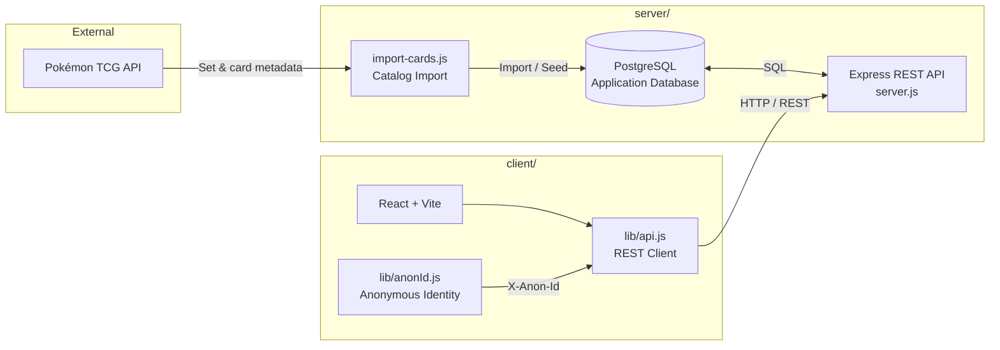

# PokeFolio

A customizable digital Pokémon TCG binder for discovering, collecting, organizing, and showcasing the cards you love.

> **Student Project — APSI Final Project**

PokeFolio recreates the experience of a physical Pokémon TCG binder as a web application. Instead of focusing on market prices, trading, deck building, or competitive play, the project focuses on the **visual collecting experience**: exploring cards, building a personal binder, organizing cards, and customizing the binder to match the user's taste.


## Features

- Explore five curated English Pokémon TCG sets
- Browse cards within a selected set
- Search cards by name within the Set Browser
- View detailed card information
- Add cards to a personal digital binder
- Browser-scoped anonymous binder identity — no account required
- Persist binder contents and customization preferences in PostgreSQL
- Move cards between binder positions
- Swap cards between occupied positions
- Move cards across binder pages and spreads
- Create and delete binder spreads
- Support 2×2, 3×3, and 4×4 binder layouts
- Automatically reflow cards when the binder grid size changes
- Preserve card order and card count during grid reflow
- Customize binder background, binder color, accent color, and theme
- Responsive Binder experience for desktop and mobile layouts

## Product Scope

PokeFolio intentionally focuses on the collecting and organization experience.

The project intentionally does **not** include:

- Card market pricing
- Trading
- Deck building
- Competitive gameplay
- User accounts or authentication

These are deliberate scope decisions rather than omitted requirements.

## Supported Sets

PokeFolio currently supports five curated English Pokémon TCG sets:

| Set | API Set ID |
| --- | --- |
| Base | `base1` |
| Team Rocket | `base5` |
| Scarlet & Violet—151 | `sv3pt5` |
| Scarlet & Violet—Paldean Fates | `sv4pt5` |
| Scarlet & Violet—Prismatic Evolutions | `sv8pt5` |

The current imported catalog contains **817 cards** across these five sets.

## User Flow

```text
Explore
   ↓
Choose a Set
   ↓
Browse / Search Cards
   ↓
View Card Details
   ↓
Add to Binder
   ↓
Organize Binder
   ↓
Customize Binder
```

## Binder

PokeFolio uses a browser-scoped anonymous UUID instead of account authentication.

Each binder contains one or more two-page spreads:

```text
Binder
├── Spread 1
│   ├── Left Page
│   └── Right Page
├── Spread 2
│   ├── Left Page
│   └── Right Page
└── ...
```

Each page can use one of three grid sizes:

- **2×2** — 4 cards per page
- **3×3** — 9 cards per page
- **4×4** — 16 cards per page

### Grid Reflow

Changing the grid size is treated as a **data transformation**, not only a visual CSS change.

When the user changes grid size, PokeFolio:

1. Reads the existing binder cards in deterministic order.
2. Calculates the required page/spread capacity for the new grid.
3. Creates additional spreads when necessary.
4. Reassigns the existing `binder_cards` rows to new positions.
5. Removes only empty trailing spreads that are no longer required.
6. Updates the user's grid preference.
7. Commits the entire operation atomically.

This guarantees that reducing the grid does **not** simply hide cards or strand them outside the visible range.

## Anonymous Binder Identity

The application does not require user accounts.

Instead, the browser receives a persistent anonymous UUID that is stored locally and sent to the Express API with binder-related requests. PostgreSQL uses that identifier to associate binder cards, spreads, and preferences with the same browser-scoped binder.

This provides persistent personal binder state without requiring an authentication system.

## Application Architecture

PokeFolio uses a layered architecture that separates external catalog ingestion, persistent application data, the REST API, and the React client.



The Pokémon TCG API is used as the external source for set and card metadata during catalog import. Imported data is stored in PostgreSQL so normal application browsing does not depend on querying the external API for every request.

The frontend communicates with Express through the shared `lib/api.js` REST client. The browser-scoped anonymous identifier from `lib/anonId.js` is included with binder-related requests so PostgreSQL can associate cards, spreads, and preferences with the same browser-scoped binder.

## Tech Stack

### Frontend

- React 19
- Vite 8
- React Router 7
- Component-level standard CSS
- Native browser drag-and-drop for Binder organization

### Backend

- Node.js
- Express 5
- PostgreSQL
- `pg`
- `cors`
- `dotenv`

### Development & Tooling

- ESLint
- Nodemon
- Git / GitHub
- Pokémon TCG API

The current client and server package scripts are defined in `client/package.json` and `server/package.json`.

## Project Architecture

### Frontend Structure

The React application is organized around feature/page boundaries rather than one monolithic component tree.

```text
client/src/
├── components/
│   └── layout/
├── lib/
│   ├── anonId.js
│   └── api.js
├── pages/
│   ├── Explore/
│   ├── SetBrowser/
│   ├── CardDetails/
│   └── Binder/
└── App.jsx
```

The Binder page is composed from dedicated Binder and BinderPage components, with customization kept within the Binder experience rather than using a separate route.

### Backend Structure

```text
server/
├── db/
│   └── migrations/
├── scripts/
├── .env.example
├── server.js
└── package.json
```

Binder mutations are handled through Express and PostgreSQL transactions. PostgreSQL remains the source of truth for persisted binder state.

## Primary Routes

| Route | Purpose |
| --- | --- |
| `/explore` | Browse the five supported sets |
| `/explore/:setId` | Browse and search cards in a selected set |
| `/card/:cardId` | View a card's details and add it to the binder |
| `/binder` | View, organize, and customize the digital binder |

## REST API Overview

The application uses Express as the frontend's server-side API boundary.

### Catalog

```text
GET  /api/sets
GET  /api/sets/:id
GET  /api/cards
GET  /api/cards/:id
```

`GET /api/cards` supports optional filtering such as set and card-name search.

### Binder

```text
GET    /api/binder
POST   /api/binder/initialize
POST   /api/binder/cards
PATCH  /api/binder/cards/:cardId
DELETE /api/binder/cards/:cardId
```

### Binder Spreads

```text
POST   /api/binder/spreads
DELETE /api/binder/spreads/:spreadId
```

### Preferences

```text
GET /api/preferences
PUT /api/preferences
```

Changing `gridSize` through the preferences endpoint triggers the transactional binder reflow described above.

## Database Architecture

The current PostgreSQL schema contains six primary tables:

```text
sets
  ↓
cards

anonymous user
  ↓
user_preferences
  ↓
binder_spreads
  ↓
binder_pages
  ↓
binder_cards
```

### Tables

| Table | Responsibility |
| --- | --- |
| `sets` | Imported Pokémon TCG set metadata |
| `cards` | Imported card metadata and image URLs |
| `user_preferences` | Binder appearance and grid preferences |
| `binder_spreads` | Two-page spread ordering |
| `binder_pages` | Left/right pages belonging to spreads |
| `binder_cards` | Card placement within binder pages |

Important database constraints enforce binder integrity, including one exact card per anonymous binder, one card per page position, valid page sides, and cascade relationships between spreads, pages, and placements.

## Pokémon TCG API Integration

PokeFolio uses the Pokémon TCG API as the external source for card and set metadata.

The backend importer stores the catalog in PostgreSQL so that the frontend does not need direct access to the external API.

The imported card records include the data required by PokeFolio:

- Card ID
- Card name
- Supertype
- Type(s)
- Card number
- Rarity
- Artist
- Small image URL
- Large image URL

Gameplay-specific and market-pricing fields are intentionally outside the data model.

## API Credentials & Environment Variables

Backend environment variables are kept in:

```text
server/.env
```

A public template is provided at:

```text
server/.env.example
```

The template currently expects PostgreSQL connection settings and a backend-only Pokémon TCG API key.

Example:

```env
PGHOST=localhost
PGPORT=5432
PGDATABASE=pokefolio
PGUSER=postgres
PGPASSWORD=your-local-postgres-password
POKEMON_TCG_API_KEY=your-pokemon-tcg-api-key
```

**Never commit `server/.env` or expose the Pokémon TCG API key to the frontend.**

## Getting Started

### Prerequisites

Before running PokeFolio locally, install:

- Node.js
- PostgreSQL
- A Pokémon TCG API key
- Git

### 1. Clone the repository

```bash
git clone https://github.com/lanixiligan/pokefolio.git
cd pokefolio
```

### 2. Install frontend dependencies

```bash
cd client
npm install
```

### 3. Install backend dependencies

```bash
cd ../server
npm install
```

### 4. Configure the backend environment

Copy the example environment file:

```bash
cp .env.example .env
```

On Windows PowerShell:

```powershell
Copy-Item .env.example .env
```

Then update `.env` with your local PostgreSQL credentials and Pokémon TCG API key.

### 5. Prepare the database

The backend provides project scripts for migrations, catalog import, and database checks:

```bash
npm run migrate
npm run seed
npm run db:check
```

Run the seed/import process only when you actually need to populate or refresh the catalog.

### 6. Start the backend

From `server/`:

```bash
npm run dev
```

The development API runs on:

```text
http://localhost:5000
```

### 7. Start the frontend

Open a second terminal:

```bash
cd client
npm run dev
```

Then open the Vite development URL shown in the terminal, normally:

```text
http://localhost:5173
```

## Development Scripts

### Frontend

From `client/`:

```bash
npm run dev
npm run lint
npm run build
npm run preview
```

### Backend

From `server/`:

```bash
npm run dev
npm start
npm run migrate
npm run seed
npm run db:check
```

The available scripts are defined in the current project package files.

## Testing & Quality Checks

Before considering a feature complete, the project uses a combination of manual integration testing and local quality checks.

### Frontend checks

```bash
npm run lint
npm run build
```

### Functional testing

Phase-based testing has covered:

- Route navigation
- Card search and card detail loading
- Add-to-Binder behavior
- Duplicate-card protection
- Occupied-slot protection
- Binder persistence
- Card movement
- Card swapping
- Cross-page and cross-spread organization
- Spread creation/deletion
- 2×2 / 3×3 / 4×4 layouts
- Grid-size reflow
- Customization persistence
- API failure handling
- Responsive behavior

The project uses PostgreSQL as the persistence layer during local integration testing rather than relying solely on frontend state.

## Project Status

PokeFolio is functionally complete and its core feature set is frozen as an academic final project.

See [`project-plan.md`](docs/project-plan.md) and [`proposal.md`](docs/proposal.md) for the detailed roadmap, architecture decisions, and historical phase planning.

## Documentation

- [`project-plan.md`](docs/project-plan.md) — historical roadmap, architecture decisions, and phase planning
- [`proposal.md`](docs/proposal.md) — course-facing project proposal and definition
- [`local-development.md`](docs/local-development.md) — local development scripts and guide

## Design Principles

PokeFolio is intentionally built around a few core engineering principles:

- **PostgreSQL as the source of truth** for persistent binder state
- **RESTful separation of concerns** between React, Express, and PostgreSQL
- **Small, focused data model** rather than a large feature-heavy schema
- **No direct external API dependency during normal card browsing**
- **Minimal frontend state** where server data can remain authoritative
- **Incremental development and phase-based testing**
- **Scoped complexity** appropriate for an academic final project while still following production-oriented engineering practices

## API Attribution

PokeFolio uses the Pokémon TCG API as an external data source for card and set metadata.

The project is not affiliated with or endorsed by The Pokémon Company, Nintendo, Game Freak, or Creatures Inc.

API credentials are private backend configuration and should never be included in public source files or documentation.

## License & Disclaimer

PokeFolio is a student project created for academic purposes.

Pokémon and Pokémon TCG-related names, trademarks, artwork, and other intellectual property belong to their respective owners. PokeFolio is an independent educational project and is not an official Pokémon product.
