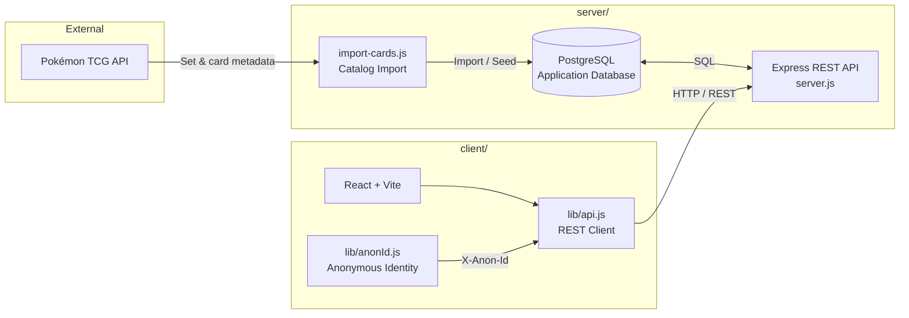

# PokeFolio Architecture

Detailed technical reference for PokeFolio. The [README](../README.md) covers what you need to get running and use the app; this document covers how it's built.

## Application Architecture

PokeFolio uses a layered architecture that separates external catalog ingestion, persistent application data, the REST API, and the React client.



The Pokémon TCG API is the external source for set and card metadata during catalog import. Imported data is stored in PostgreSQL so normal application browsing does not depend on querying the external API for every request. The frontend talks to Express through the shared `lib/api.js` REST client, and the browser-scoped anonymous identifier from `lib/anonId.js` is included with binder-related requests so PostgreSQL can associate cards, spreads, and preferences with the same browser-scoped binder.

## Tech Stack

### Frontend

- React 19
- Vite 8
- React Router 7
- Component-level standard CSS
- Native browser drag-and-drop for Binder organization

### Backend

- Node.js
- Express 5
- PostgreSQL
- `pg`
- `cors`
- `dotenv`

### Development & Tooling

- ESLint
- Nodemon
- Git / GitHub
- Pokémon TCG API

Current package scripts are defined in `client/package.json` and `server/package.json`.

## Frontend Structure

The React app is organized around feature/page boundaries rather than one monolithic component tree. The Binder page is composed from dedicated `Binder` and `BinderPage` components, with customization kept within the Binder experience rather than a separate route.

## Backend Structure

Binder mutations are handled through Express and PostgreSQL transactions. PostgreSQL remains the source of truth for persisted binder state.

## Anonymous Binder Identity

PokeFolio has no user accounts. Instead, the browser receives a persistent anonymous UUID that's stored locally and sent to the Express API (as `X-Anon-Id`) with binder-related requests. PostgreSQL uses that identifier to associate binder cards, spreads, and preferences with the same browser-scoped binder — giving persistent personal binder state without an authentication system.

## Grid Reflow

Changing a page's grid size (2×2 / 3×3 / 4×4) is treated as a data transformation, not just a visual CSS change. When the user changes grid size, PokeFolio:

1. Reads the existing binder cards in deterministic order.
2. Calculates the required page/spread capacity for the new grid.
3. Creates additional spreads when necessary.
4. Reassigns the existing `binder_cards` rows to new positions.
5. Removes only empty trailing spreads that are no longer required.
6. Updates the user's grid preference.
7. Commits the entire operation atomically.

This guarantees that reducing the grid size does not simply hide cards or strand them outside the visible range.

## Database Architecture

The PostgreSQL schema has six primary tables:

```text
sets
  ↓
cards

anonymous user
  ↓
user_preferences
  ↓
binder_spreads
  ↓
binder_pages
  ↓
binder_cards
```

| Table | Responsibility |
| --- | --- |
| `sets` | Imported Pokémon TCG set metadata |
| `cards` | Imported card metadata and image URLs |
| `user_preferences` | Binder appearance and grid preferences |
| `binder_spreads` | Two-page spread ordering |
| `binder_pages` | Left/right pages belonging to spreads |
| `binder_cards` | Card placement within binder pages |

Database constraints enforce binder integrity: one exact card per anonymous binder, one card per page position, valid page sides, and cascade relationships between spreads, pages, and placements.

## Pokémon TCG API Integration

The backend importer (`import-cards.js`) stores the catalog in PostgreSQL so the frontend never needs direct access to the external API. Imported card records include:

- Card ID, name, supertype, type(s), card number, rarity, artist
- Small image URL, large image URL

Gameplay-specific and market-pricing fields are intentionally outside the data model — see the README's [Out of scope](../README.md#out-of-scope-by-design) section.

## Design Principles

- PostgreSQL as the source of truth for persistent binder state
- RESTful separation of concerns between React, Express, and PostgreSQL
- Small, focused data model rather than a large feature-heavy schema
- No direct external API dependency during normal card browsing
- Minimal frontend state where server data can remain authoritative
- Incremental development and phase-based testing
- Scoped complexity appropriate for an academic final project while still following production-oriented engineering practices

## Development Scripts

**Frontend** (from `client/`):

```bash
npm run dev
npm run lint
npm run build
npm run preview
```

**Backend** (from `server/`):

```bash
npm run dev
npm start
npm run migrate
npm run seed
npm run db:check
```

## Testing & Quality Checks

Frontend checks:

```bash
npm run lint
npm run build
```

Functional testing has been phase-based, manually covering: route navigation, card search and detail loading, add-to-binder behavior, duplicate-card and occupied-slot protection, binder persistence, card movement and swapping, cross-page/cross-spread organization, spread creation/deletion, all three grid layouts and grid-size reflow, customization persistence, API failure handling, and responsive behavior. PostgreSQL is used as the persistence layer during local integration testing rather than relying solely on frontend state.
